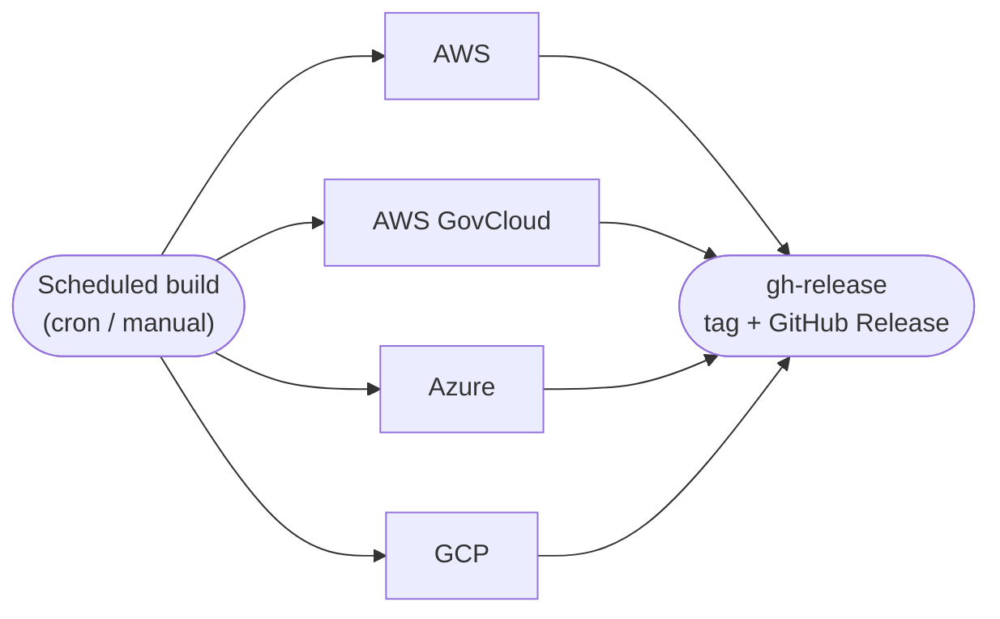
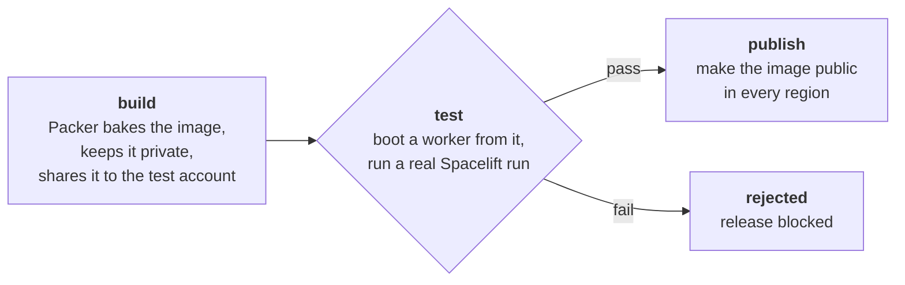

# Building, testing and publishing worker images

Spacelift worker images — AWS AMIs, Azure gallery images, GCP images — are baked with
Packer and published on the
[Releases](https://github.com/spacelift-io/spacelift-worker-image/releases) page.
Spacelift's own public worker pool and customers' private worker pools boot from them.

A bad image breaks **every run on every worker** that uses it, so an image is **validated on a
real worker before it is published**.

## General flow

Every cloud follows the same three-stage pipeline, orchestrated by
`.github/workflows/build_scheduled.yml` (weekly cron + manual dispatch), with one reusable
workflow per cloud (`job_build_publish-{aws,azure,gcp}.yml`). The per-cloud workflows fan out in
parallel; a final `gh-release` job runs once they all succeed:

Each per-cloud workflow is the same **build → test → publish** gate — the image only goes public
if it passed a real run on a real worker:

- **build** — Packer builds the image **private** (not customer-visible) and shares it only
  with the identity the test needs to boot it.
- **test** — the gate: a dedicated test worker pool is pointed at the new image, cycled so a
  fresh worker boots from it, and a real Spacelift run is executed on that worker. No worker,
  or a failed run → the image is rejected.
- **publish** — only on a green test, the image is made public in every region. The final
  `gh-release` job then tags the repo and publishes a GitHub Release listing every image ID —
  that release is the pointer customers consume.

A failed test skips publish and blocks that cloud's entry in the weekly release.

## Testing approach (all clouds)

The gate is end-to-end, not a static/boot check — it exercises the same path a customer run takes:

1. **Point** the pool at the new image. AWS/GCP set it on the pool's Terraform
   (`spacectl stack environment setvar TF_VAR_…`). Azure instead swaps the image directly on the
   VMSS with `az` (no `setvar`, no apply), so a failed test never pins the pool's Terraform to a bad
   version — see the Azure section.
2. **Cycle** the pool so a worker boots from the new image (AWS: ASG instance refresh; GCP: the MIG
   rolls on the Terraform apply; Azure: `az vmss update` + reimage).
3. **Wait** for a new worker to register and go idle, and for the old workers to drain.
4. **Run** the `ami-resilience-testing` stack on the pool. A green run is the proof.

Test jobs authenticate to Spacelift over **GitHub → Spacelift OIDC** (no static Spacelift API
keys in CI). All test infrastructure (worker pools + test stacks) is Terraform under
`infra/stacks/`, deployed on the preprod Spacelift instance `spacelift-ci-gh.app.spacelift.dev`.

## AWS

The published artifact is an **AMI**, built per architecture (x86_64 and arm64) in every region.
What's specific to AWS:

- **Public/private is a launch-permission flip.** The AMI is registered private and only made
  public — in every region — once the test passes. It's built **unencrypted**, because AWS won't
  let an encrypted AMI be made public.
- **The test pool boots the private AMI** through a temporary cross-account share; an ASG instance
  refresh then cycles a worker onto it and the test run executes there.
- Only **x86_64** is gated (the test pool is x86_64); arm64 publishes without the on-pool test.

Details live in `.github/workflows/job_build_publish-aws.yml`, `aws.pkr.hcl`, and
`infra/stacks/workerpool-aws/`.

**GovCloud** runs the same flow in the AWS GovCloud partition — its own accounts, regions, and test
stacks — via `.github/workflows/job_build_publish-aws-govcloud.yml`.

## Azure

The published artifact is a single **Shared Image Gallery version** (`3.0.<n>`), replicated across
many Azure regions and exposed to customers through a **community gallery**. What's specific to Azure:

- **Public/private is the `excludeFromLatest` flag.** The new version is published *excluded from
  latest*, so customers tracking "latest" never pick it up, while the test can still deploy it by
  explicit version. Publishing = clearing that flag once the test passes.
- **The test pool is a VMSS.** The new image is set on the scale set and its instance is reimaged so
  the worker re-registers on it. The swap is done directly on the VMSS, not through the pool's
  Terraform, so a failed test never pins the pool to a bad version.

Details live in `.github/workflows/job_build_publish-azure.yml`, `azure.pkr.hcl`, and
`infra/stacks/workerpool-azure/`.

## GCP

The published artifact is a set of three **Compute Engine images** (US, EU, Asia; amd64). What's
specific to GCP:

- **Public/private is an IAM binding.** Images are built project-private; publishing grants
  `allAuthenticatedUsers` the `roles/compute.imageUser` role on all three. During the test, the
  image under test is shared only to the test pool's service accounts so it can boot while private.
- **Only the US image is gated;** all three (identical content) publish together. The test points
  the pool at the new image and applies — the managed instance group (MIG) rolls a worker onto it,
  and that worker is confirmed to have booted from the exact image under test before the run.

Details live in `.github/workflows/job_build_publish-gcp.yml`, `gcp.pkr.hcl`, and
`infra/stacks/workerpool-gcp/`.
